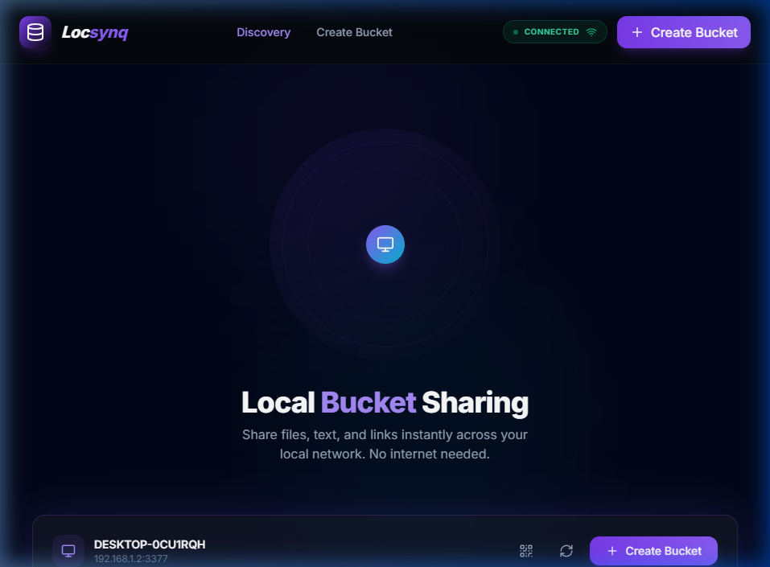

<p align="center">
  
</p>

<p align="center">
  
  
  
  
</p>

---

# 🪣 Locsynq
**Locsynq** is an enterprise-grade, offline-first, LAN-based bucket sharing platform. Designed for high-performance file sharing in environments like computer labs, offices, and classrooms, it allows users to distribute files, text, and links instantly across a local network without requiring an internet connection.

### 🎥 Preview
<p align="center">
  
</p>

---

## 🔥 Core Features

- 🌐 **Zero-Config Discovery** — Uses mDNS (Bonjour/Avahi) to automatically find other Locsynq instances on your local subnet. No IP typing required.
- 📂 **High-Capacity Buckets** — Create specialized sharing "buckets" that support large file streaming (up to 5GB) with range-request support for interrupted downloads.
- ⚡ **Real-Time Synchronization** — Powered by WebSockets, every file upload or note added is instantly visible to all connected peers.
- 🔐 **Secure Access Control** — Optional PIN-protected buckets with JWT-based session security and owner-exclusive management features.
- 🕒 **Temporary Buckets** — Set expiration timers for time-sensitive sharing (perfect for classroom handouts).
- 📱 **Cross-Platform Responsive** — A stunning glassmorphic UI built with React and Tailwind CSS, optimized for desktop, tablet, and mobile.

---

## 🏗️ System Architecture

Locsynq is built as a high-performance monorepo using a modern technology stack:

| Layer | Technology | Responsibilities |
|-------|------------|------------------|
| **Frontend** | React, Vite, Tailwind CSS, Zustand | State management, discovery UI, PWA capabilities. |
| **Backend** | Node.js, Express, WebSocket (ws) | API handling, file streaming, socket broadcasting. |
| **Discovery** | mDNS (Bonjour) | Zero-configuration peer announcements. |
| **Shared** | TypeScript | Unified types and constants between CLI, API, and UI. |

---

## 🚀 Quick Start

### 1. Prerequisites
- **Node.js**: v18.0.0 or higher
- **npm**: v9.0.0 or higher

### 2. Installation
```bash
# Clone the repository
git clone https://github.com/mr-sanjai-offl/locsynq.git
cd locsynq

# Install dependencies (All packages in monorepo)
npm install

# Build the shared type package
npm run build:shared
```

### 3. Running the App
For development (with hot-reload):
```bash
npm run dev
```
- **Access App**: `http://localhost:5173`
- **Network URL**: `http://YOUR_LOCAL_IP:5173`

For production:
```bash
npm run build
npm start
```

---

## 📁 Project Overview

```text
/locsynq
├── 📁 apps
│   ├── 📁 backend      # Node.js + Express + WebSocket core
│   └── 📁 frontend     # React + Vite + Tailwind UI
├── 📁 packages
│   └── 📁 shared       # Type definitions and shared logic
├── 📁 docker           # Production container configuration
└── 📁 docs             # Screenshots and documentation assets
```

---

## 📡 API Endpoints (Snapshot)

| Method | Endpoint | Description |
|--------|----------|-------------|
| `POST` | `/api/bucket/create` | Create a new LAN bucket |
| `GET` | `/api/bucket/list` | Discover all active network buckets |
| `POST` | `/api/bucket/:id/upload` | High-speed multipart file upload |
| `GET` | `/api/bucket/:id/files/:name` | Resumable file streaming |
| `GET` | `/api/peers` | Health check and peer telemetry |

---

## 🛠️ On-Premises & Cloud Deployment

### Local Server Deployment
Locsynq is designed to run on a local server, Raspberry Pi, or NAS.
```bash
cd docker
docker-compose up -d
```

### Cloud Deployment (Render/Heroku)
Locsynq supports cloud environments for "Hybrid LAN" sharing.
1. Set `NODE_ENV=production`
2. Set `RENDER_EXTERNAL_URL` to your public hostname.
3. Use the integrated build script: `bash ./scripts/render-build.sh`

---

## 🔐 Security Standards

- **JWT Auth**: Session-based security for protected buckets.
- **Sanitized Streams**: Filename and path traversal protection for all I/O.
- **PIN Hashing**: Secure local storage of bucket credentials.
- **CORS Restricted**: Locked down to LAN subnets by default.

---

## 📝 License

Distributed under the **MIT License**. See `LICENSE` for more information.

---

<p align="center">
  Built with ❤️ for the open-source community by <b>Sanjai</b>
</p>
